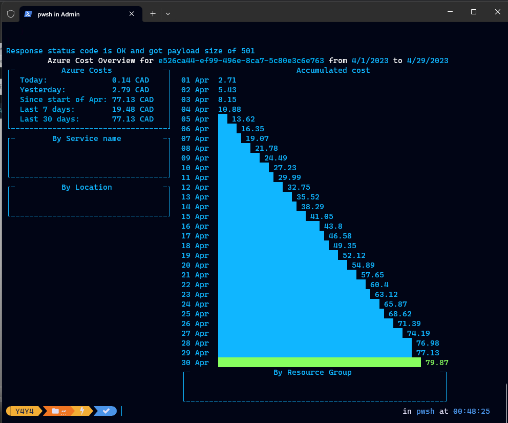

# Azure Costs From CLI

[Install the tool](https://github.com/mivano/azure-cost-cli#installation)

- **Print Costs**

```
azure-cost accumulatedCost -s <SubscriptionID> --debug
```

- **And output JSON**
```
azure-cost accumulatedCost -s <SubscriptionID> -o json
```

- **Direct to JSON file**
```
azure-cost show -s <SubscriptionID> -o json > cost.json
```
- **Direct to Text file**
```
azure-cost costByResource -s <SubscriptionID> -o text
```

- **Direct to Markdown file**
```
azure-cost show -s <SubscriptionID> -o markdown > cost.md
```

- **Query from yesterday**
```
azure-cost -s <SubscriptionID> -o json --query "totals.yesterdayCost"
```

**Performing cost review using the tool**




> [cause](https://www.linkedin.com/feed/update/urn:li:activity:7058067925382918144/)
